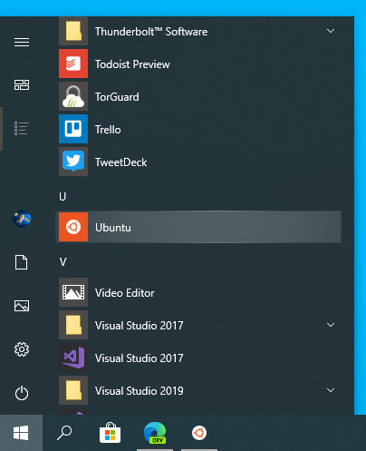

  

    <strong>@author:</strong> James V. Talwar 
    <strong>@adapted by:</strong> Adam Klie for 2024 Class
  

# 
<b>Glancing Through the Windows: Setting up a Linux terminal on a Windows machine</b>

If you are working on a machine that runs a Windows operating system, you don't have a built-in Linux terminal. This terminal is the interface to data and programs most commonly used in Bioinformatics and the one we will be using in this course.

This is a quick start guide to set up a Linux terminal on your machine through [Ubuntu](https://ubuntu.com/desktop/wsl).

If you are using a Mac or Linux machine, you can skip this step and move on to the next one.

# Step 1: Ubunt-Who?

Search for Windows PowerShell in your Windows search bar, then select Run as administrator.

When powershell opens type `wsl --install -d ubuntu` and sit tight until this process completes. **When finished you will need to restart your computer.**

# Step 2: Let's try that again...
Restart your computer...

# Step 3: Configure-Eight Ubuntu
After restarting (and hopefully successfully installing) launch Ubuntu. An easy way to do this is searching for Ubuntu in the search bar:  

Now after selecting Ubuntu you should see a Ubuntu terminal running. This means progress! If not and you run into an installation error there is likely an issue in your [BIOS configuration](https://ubuntu.com/tutorials/install-ubuntu-on-wsl2-on-windows-10#4-configure-ubuntu) (see the info box). Allow Ubuntu to finish its initial setup. Once complete enter a username and password. Finally ensure things are up to date by running `sudo apt update` (entering your password when asked for it) and then `sudo apt upgrade` pressing Y when prompted.

# DONE!

You can now move onto the next step: [2_TSCC](2_TSCC.md)

---
