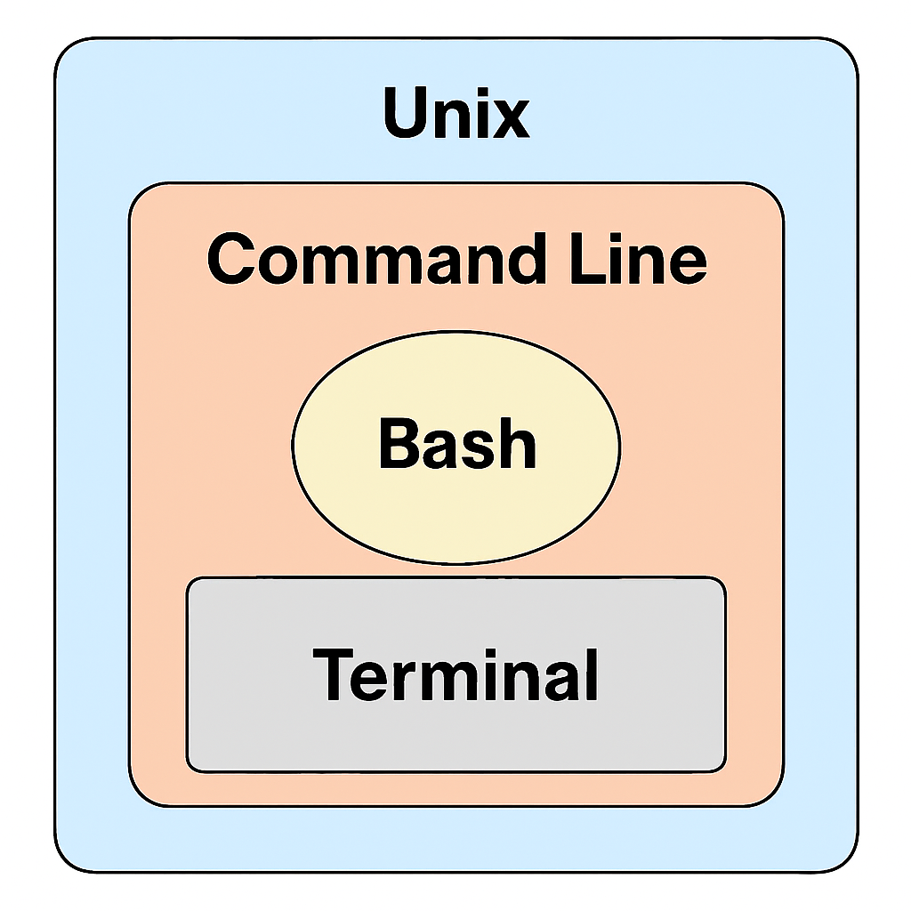

<div style="border: 2px dashed #6c757d; padding: 10px; border-radius: 10px; background-color: #f8f9fa; text-align: left; margin-bottom: 20px;">
  <p style="font-size: 18px; color: #343a40; font-family: 'Courier New', Courier, monospace;">
    <strong>@author:</strong> Adam Klie<br>
    <strong>@adapted by:</strong> Vicente Fajardo Rosas for 2025 class.
  </p>
</div>

# <div align="center"><b>Introduction to Unix and Bash</b></div>


# Background

We will first attempt to define and differentiate among Unix, the command line, Bash and the terminal. Although often used interchangeably, the reality is that albeit they are highly related to one another (as presented in the diagram below), they are different components of your computer.



## What is Unix?

Unix is a widely used operating system developed in the late 1960s. Unix has been very influential in the development of many modern operating systems, including those underlying most Linux and Mac machines. In fact, you can think of these operating systems as variants of Unix.

## The command line

We typically interact with Unix and Unix-variants via something called the “command line”. The command line is a text-based interface where you type "input" commands and see "output" results. This is in contrast to the graphical user interfaces (GUIs) that most of us are familiar with, which allow you to interact with the computer by clicking on icons and buttons.

It may suprise you to learn that much of work done in bioinformatics still involves using the command line. This is partially because many bioinformatics tools are designed to be used in a Unix environment, but also has to do with the fact that the command line is actually several times more efficient than building a GUI for every possible task.

## Bash (Bourne-Again [SHell](https://en.wikipedia.org/wiki/Shell_(computing)))

Bash is the programming language that let's us interact with the operating system. It interprets commands to execute programs, navigate the file system, and automate tasks. Learning Bash is an essential step for any bioinformatician.

## The Terminal

The terminal is a place where you work with the command line to interact with your operating system. Rather confusingly, the terminal is also sometimes called the "command line" or "shell."

# Basic commands


Getting comfortable with Unix is all about practice, repitition and patience. Let's try logging on to TSCC to do some of these exercises. If you've forgotten how to log onto TSCC, please refer to the [TSCC tutorial](../Day_0_Setup/2_TSCC.md).

## *Where are you currently?*

When using a terminal you will always be inside a folder, or directory. But, at any given time, you may lose track of what directory you are currently in. To check where we are, we use "print working directory", or `pwd`:

```bash
pwd
```

What does your output look like? This is mine:

```bash
/tscc/nfs/home/vfajardorosas
```

This is the "path" to my current, or working, directory. The path details the location of the directory in the file system. The file system is the way an operating system organizes files on a disk. The file system is hierarchical, meaning that files are organized in a tree-like structure of directories, or folders. The root directory is the top of the file system hierarchy. In Unix, the root directory is denoted by a forward slash `/`.

My current directory also happens to be my home directory, or starting point when I log into TSCC. The shortcut to get back to this point is the tilde (`~`). If we ever wanted to get back to this home directory from any other directory, we would simply type:

```bash
cd ~
pwd
```

## *Where can we go?*

Now that we know where we are, we should try and see what folders exist in in my current working directory:

```bash
ls
```

What do you see?

If you began and/or completed your installations (**and hopefully you did!**), your accounts likely have 2 things in them:

 1) The miniconda installation script - `Miniconda3-latest-Linux-x86_64.sh` <br>
 2) Your miniconda installation - `miniconda3` <br>

If you didn't begin installations or ran into issues, your accounts will probably be empty.

Regardless of whether your home directory is empty or not, let's start making things in our working directories!

## Making and navigating directories

Let's make a new directory in our own home directory called "bootcamp" using the command `mkdir`:

```bash
mkdir bootcamp
```

Let's use `ls` to see what our home directory looks like now:

```bash
ls
```

You should now see `bootcamp`. Let's navigate to the `bootcamp` by using the command `cd`, or change directory:

```bash
cd bootcamp
```

Try pwd again. The output will be different than before.

```bash
pwd
```

```bash
/tscc/nfs/home/vfajarorosas/bootcamp
```

You are now in the `bootcamp` directory that you just created. This is how you will make new directories to properly organize your own workspace. `mkdir`, `cd` and repeat~

When naming a new directory, it is always a good idea to separate words by an underscore ( _ ) to prevent unsual notation.  For instance, `mkdir new_directory` is preferred to `mkdir new directory`. White space is the bane of the bioinformatician's existence! It is always best to avoid it when naming files and directories.

You can also make many levels of subdirectories simultaneously using the `mkdir` command by adding something called a "flag":

```bash
mkdir -p test1/test2/test3
```

Here the `-p` is a flag that means "make parent directories as needed." This can be a fast way of creating new directories several levels lower without having to first navigate to the level immediately below the one you started in.

To move back up a level in your directory hierarchy, you will use two periods `..` to do so:

```bash
cd ..
```

This will move you up one level. To move up two levels simply use `..` separated by a `/`

```bash
cd ../..
```

This will allow us to change our "relative path", or location relative to where we are now. Let's go back home for now:

```bash
cd ~
```

We can also change directories to an "absolute path", where the entire path is defined in identifying our *absolute* location in the file system:

```bash
cd ~/bootcamp/test1/test2/
pwd
```

```bash
/tscc/nfs/home/vfajardorosas/bootcamp/test1/test2
```

## Making a new file with text editor 

Now that we're in our new directory, let's make a blank text file here. To do so, we will use a program called `vi`, one of many text editor applications. Others include `emacs` and `nano` (mentioned in this [Unix tutorial](http://korflab.ucdavis.edu/bootcamp.html)), and each of these editors has their own unique feel. For this module, however, we will stick with using `vi`.

Start by navigating back to the `bootcamp` directory:

```bash
cd ~/bootcamp/
```

Then type:

```bash
vi test_file.txt
```

This will open a blank screen with several ~ on the left-hand side:

```bash
~                                                                                                                  
~                                                                                                                  
~                                                                                                                  
~                                                                                                                  
~                                                                                                                  
~                                                                                                                  
~                                                                                                                  
~                                                                                                                  
~                                                                                                                  
~                                                                                                                  
~                                                                                                                  
~                                                                                                                  
"test_file.txt" [New]
```

This is the text file (`test_file.txt`) that you just created. The filename will be displayed at the bottom left hand corner with a `[New]` label. You can use the arrow keys to move the cursor around the file. You can enter `Insert` mode by pressing `<i>` to edit the contents of your document, followed by typing in whatever you would like. To exit `vi`, we first need to get out of `Insert` mode with the `<esc>` key, followed by `<:wq>` to save and quit (`w` to save, `q` to quit). 

### Note: Syntax note applicable to all markdown files in this repo.
Note that `<keys>` indicates a key or set of keys instead of actual text being typed onto the terminal. When multiple keys are given within the angle brackets, this indicates that the keys are followed by `<enter>`. **Examples**:<br>
`<tab>` indicates the key tab pressed once on the keyboard.<br>
`<tab><tab>` indicates the key tab pressed twice on the keyboard.<br>
`<:wq!>` indicates the keys `:`, `w`, `q` and `!` pressed altogether followed by enter.<br>

Let's see if we can put that altogether:

```bash
vi test_file.txt
<i>
I am writing in a new text file
<esc>
<:wq> [or] <:x!>
```

Did it work? Let's check by looking at the contents of our directory using:

```bash
ls
```

Mine says:

```bash
test_file.txt
```

## Viewing files

Let's take a look at the contents of our text file.

```bash
cat test_file.txt
```

It should look something like

```bash
I am writing in a new text file
```

`cat` is the simplest command to view a file in Linux. It simply prints the content of files. This is ok in this situation where our file is only 1 line, but imagine if we have a file with many (up to millions) of lines, your screen would be flooded with text!

This is where the `less` command comes in. To showcase its power, let's apply it to one real-life file. For the remaining part of this demo, let's make a copy of the `day_1` folder from my home folder to your own:<br/>
```bash
cd ~
pwd
ls
cp -R /tscc/nfs/home/hkcarter/toy_data .
ls
```

We'll see the details of command `cp` later on (below). Fow now, let's relocate to the folder with the files needed for this demo:<br/>
```bash
cd toy_data
ls
```
We can see three files, including `rna.fna` and `protein.faa`, which contain RNA nucleotide and protein amino acid sequences, respectively, of different isoforms of the human gene *ITGAE* that encodes protein CD103 (one of my favorites).

The `less` command views the file one page. You can exit by less by simply typing `<q>` followed by `<enter>`.

```bash
less rna.fna
<q>
less protein.faa
<q>
```

What if you want to print just the first or last 10 lines of a file. This can be useful if you just want to get a sense of what the file contains. **head** and **tail** are good linux commands for this purpose. Head prints the first *n* lines of a file and tail prints the last *n* lines of a file.

```bash
head rna.fna
tail rna.fna
head protein.faa
tail protein.faa
```

By default 10 lines are printed, you can change the number of lines printed with the `-n` flag. Flags are specific to a commmand, and can be looked up using the `man` function. If we wanted to look up the flags for the `head` command for instance, we would use:

```bash
man head
```

How can we change the number of lines printed?

```bash
head -n 20 rna.fna
tail -n 20 rna.fna
head -n 20 protein.faa
tail -n 20 protein.faa
```

This has allowed us to get a sense of the files, and hopefully notice the difference between nucleotide and aminoacid sequence files.

## Editing a file

Let's go back and edit the text file we had made ourselves, with a copy of it already located in this folder (`test_file.txt`):

```bash
vi test_file.txt
<i>
```

Use your arrow keys to go to the end of the prompt, delete what we wrote previously with backspace, and write:

```bash
I am editing an existing text file
<esc>
<:wq!>
```

Let's look at our file now using either `less`, `cat`, `head`, or `tail`:

You can see that we overwrote our original contents. `vi` can be used for both making new files and editing pre-existing ones too!

If after making corrections you decide you don't like them and want to exit the file without saving changes, you can press `esc`, then `:q!` (q to quit, ! to force):

```bash
vi test_file.txt
<i>
[make changes to file]
<esc>
<:q!>
```

## Use tabs for auto-completion

_Many mistakes in programming are introduced by typos_. We can use bash's built-in auto-completion to help us avoid this. This is often most useful in navigating the file system. As an example, let's go from our home directory to our newly created file:

```bash
cd ~
```

If we begin typing "bootcamp", but press tab part-way through, our computer can fill out the rest if the word is unique:

```bash
cd boot<tab>
cd bootcamp/
```

Great, now let's type "te" and then tab to let auto-completion due it's thing.

Hang on a sec. What happened? If there multiple files or directories that have the same prefix, you can press tab twice to see all the objects that fit this description. Then, you can add additional characters and use tab complete to go to the file or directory of interest.

```bash
less test<tab><tab>
test1/         test_file.txt
less test_<tab>
less test_file.txt
```

This is a very useful way to adavnce without making any careless typos. We call also use tabs to list the contents of a directory we are interested in looking into next:

```bash
cd /tscc/nfs/home/vfajardorosas/<tab><tab>
```

This will display all the files in your home directory, even the [**hidden ones**](https://www.cyberciti.biz/faq/unix-linux-centos-ubuntu-find-hidden-files-recursively/) (file names begin with a ".")

**I promise that tab completion will make your work (and thus your life) much, much easier!**

## Copying a file

Let's make a copy of the RNA nucleotide sequence text file under the name `rna_cp.fna`. We can do this using the following syntax:

```bash
cd ~/toy_data
cp rna.fna rna_cp.fna
```

We should now have two identical copies of the same file in the same directory.<br/>
We can also make copies of the entire content of one directory with the flag `-R`. Accordingly, copying will follow any of the following general structures:

```bash
cp /path/to/source_file_name /path/to/destination_file_name # For files
cp -R /path/to/source_directory /path/to/destination_directory # For directories
```

## Moving/renaming a file/directory

If we want to move a file or an entire directory, we can do so using the `mv` command:

```bash
mv file.txt new_destination/ # For files.
mv /path/to/location/of/directory /path/to/new_location # For directories.
```

Let's try this with one of our text files:

```bash
mkdir move_file
mv test_file.txt move_file/
cd move_file/
ls
```

The `mv` command also works for renaming files. For instance, if we wanted to rename `test_file.txt` to `really_interesting_file.txt`, we would just enter:

```bash
ls
mv test_file.txt really_interesting_file.txt
ls
```

The contents of the file will be exactly the same, but its name will now be different. These principles also apply for moving and renaming directories.

## Deleting a file

To remove a file, we use a command known as `rm`. Simply make sure that you are in the directory that houses the file that you wish to delete, and perform the following:

```bash
rm really_interesting_file.txt
```

To remove a directory, you may still use `rm`, though you will aneed to provide the `-r` flag to remove recursively:

```bash
cd ~
rm -r bootcamp
```

**Be ABSOLUTELY sure that you are prepared to lose this file or directory in question as it will be impossible to recover after deletion.** 

## Organize your home directory

Organization is a really difficult thing in computational biology, and everyone has their own preferences. I recommend making at least three folders in your home in addition to sub-folders within your projects directory as we add new projects. Really it doesn't matter how you do this, as long as your are organized, understand your own setup and communicate that to others who may be involved in your projects. For the purposes of this class, it is easiest for discussion if we are all operating under the same setup.

Make **3 directories in your home directory named scripts, projects and raw_data**

```bash
mkdir ~/projects
mkdir ~/scripts
mkdir ~/raw_data
```

## Making softlinks

Softlinks are a great way to easily access files without copying the entire thing into a new directory. Copying files uses a lot of unnecessary space, but sometimes it is annoying to have to give the full path of a filename every time you want to use it. To get around this, we make a "softlink" to the real file. A softlink is a pointer to the file doesn't require the space of the full file. Since we will be using our `scratch` directory a lot, we are going to make a softlink to that file in our home.

To make a softlink:

```bash
ln -s sourcefilename destination
```

Now let's make a softlink to our scratch directories in our home directory and check the softlink worked properly.

```bash
cd
ln -s /tscc/lustre/ddn/scratch/vfajardorosas ~/scratch
ls
```

My output for the newly created scratch softlink looks like this:

```bash
lrwxrwxrwx    1 vfajardorosas htl191   30 Jul 30 08:46 scratch -> /tscc/lustre/ddn/scratch/vfajardorosas/
```

## Resources

This notebook only scratches the surface of what we can do with Unix/bash. Here are some resources to help you learn more:

- [Bootcamp command line cheatsheet](https://github.com/cartercompbio/2025-MSTP-Bioinformatics-Bootcamp/blob/main/resources/Command_Line_Cheatsheet.md): 
- [Online bash cheatsheet](https://learncodethehardway.org/unix/bash_cheat_sheet.pdf) (I like to print these kinds of things out and keep them by my computer)
- [UC Davis' Command-line Bootcamp page](http://korflab.ucdavis.edu/bootcamp.html)

# DONE!

---
