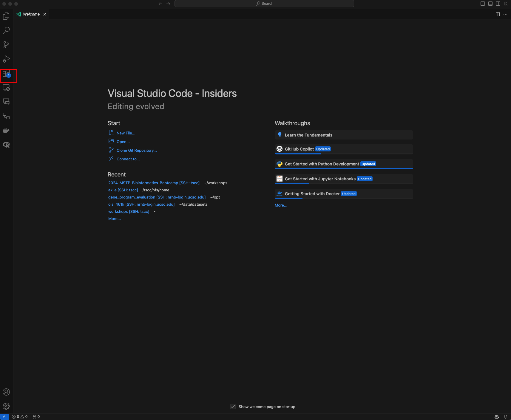
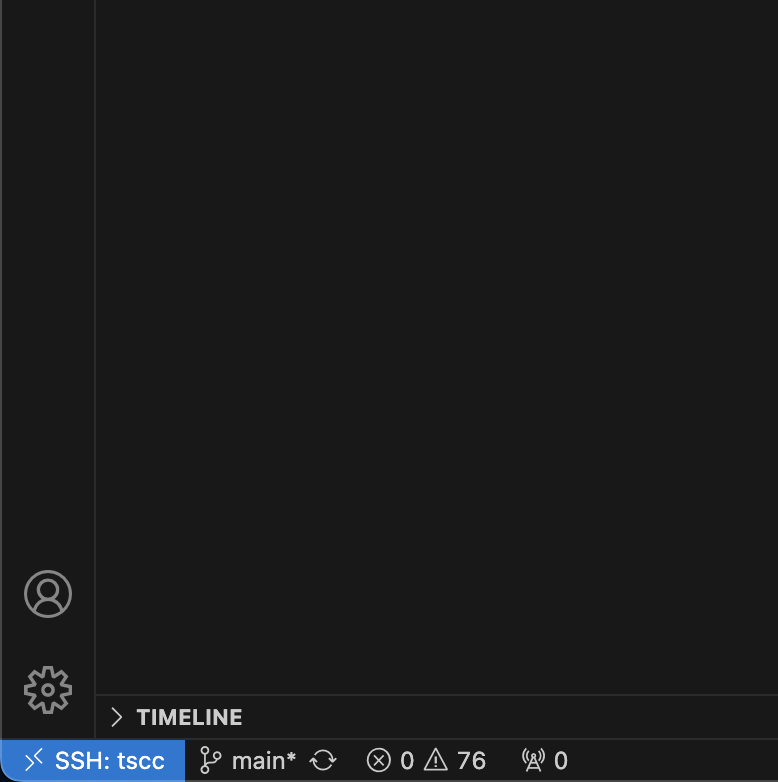
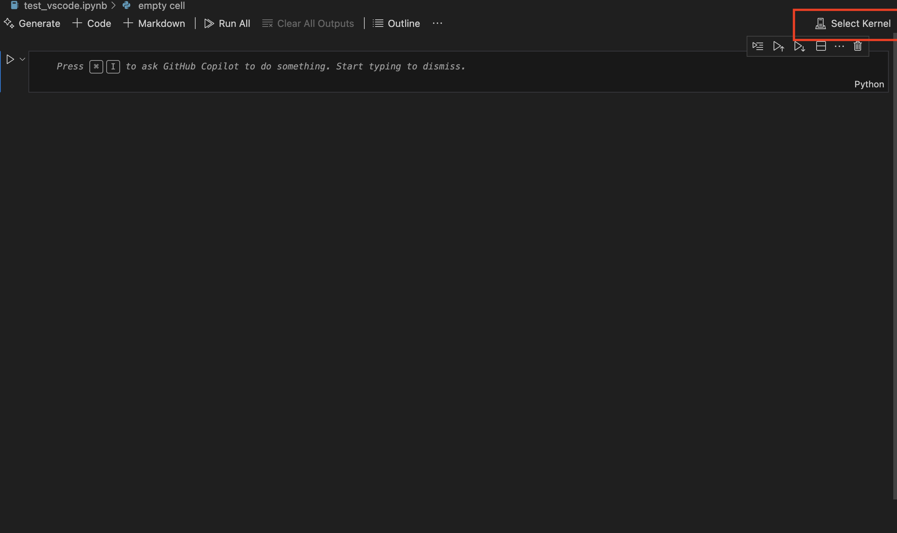

# <div align="center"><b>Opening Jupyter Notebooks on TSCC</b></div>


The command line is a bioinformatician's work horse, but doesn't offer the most interactive or visual interface. [Jupyter](https://jupyter.org/) notebooks are a commonly used alternative which allows you to load in data, manipulate it, make pretty figures, export your final data and figures, and annotate your workflow all in one place!

# Running Jupyter notebooks

Normally, we could use the following command to run a Jupyter notebook:

```bash
jupyter notebook
```

This would generate a Jupyter notebook session that we could access via a simple URL.

However, since we are on a remote server (TSCC), our local machines have no way of knowing where the Jupyter session lives.

Lucky for us, the nice folks over at TSCC have set up a program for us to run Jupyter notebooks on the server and access them on our local machines.

# Using `galyleo` to connect to Jupyter notebooks

`galyleo` is a utility command to help you launch Jupyter notebooks on high-performance computing (HPC) systems. To use `galyleo`, you need to first load the `galyleo` module on TSCC:

```bash
module load galyleo
```

Note that we don't have to install `galyleo` because it is already comes pre-installed on TSCC.

It can then be run in much the same way as a interactive job on TSCC. Here is an example command:

```bash
galyleo launch --account htl191 --cpus 1 --memory 4 --time-limit 1:00:00 --partition hotel --qos hotel
```

Let's break that down:
- `galyleo launch` is the command to start a Jupyter notebook session
- `--account htl191` specifies the allocation to use. Remember this is the allocation we used for running the interactive job for installing software.
- `--cpus 1` specifies the number of CPUs to use. This is the number of CPUs that will be allocated to the Jupyter notebook session. For the purposes of this bootcamp, we will only need 1 CPU.
- `--memory 4` specifies the amount of memory to use. This is the amount of memory that will be allocated to the Jupyter notebook session. For the purposes of this bootcamp, we will only need 4 GB of memory.
- `--time-limit 1:00:00` specifies the time limit for the Jupyter notebook session. 
- `--partition hotel` specifies the partition to use. This is the same partition we used for the interactive job for installing software.
- `--qos hotel` specifies the quality of service to use. This is the same quality of service we used for the interactive job for installing software.

For more details and a full list of possible options: https://github.com/mkandes/galyleo

If successful, you should see something like this:

```bash
Submitted Jupyter launch script to Slurm. Your SLURM_JOB_ID is 1994809.
Success! Token linked to jobid.
Please copy and paste the HTTPS URL provided below into your web browser.
Do not share this URL with others. It is the password to your Jupyter notebook session.
Your Jupyter notebook session will begin once compute resources are allocated to your job by the scheduler.
https://shopping-strife-reexamine.tscc-user-content.sdsc.edu?token=d3f6d542acbfa6dcbccfcb0b9c9bd779
```

As the instructions indicate, copy and paste the URL into your web browser. You should see a Jupyter notebook session open up in your browser.

## Starting a notebook

Galyleo actually loads something called [JupyterLab](https://jupyter.org/try-jupyter/lab/). JupyterLab is a flexible and powerful user interface for programming called an Integrated Development Environment or IDE. You can access new Jupyter notebooks via JupyterLab, open existing ones, and perform many other tasks. Once opened, you should see a GUI interface like this:


Most of the time, you will want to start a new notebook. This can be done anytime by clicking on the `+` sign in the top left corner and selecting any of the options under the `Notebook` section.

Here is where our previous installations come in handy. You can now use the Jupyter notebook to run Python code, and you can use the Python packages we installed to analyze your data.

Play around with Jupyter, notebooks, and the environment as a whole. We will work through these together initially.

# Ending a Jupyter notebook session

When you are done with your Jupyter notebook session, you can close the tab in your browser. Note, this only closes your connection to the session and will not end the session. You can always return to this URL to resume the session, as the session will continue to run on the server until the time limit is reached.

# DONE!

---

<div style="border: 2px solid #4CAF50; padding: 15px; border-radius: 10px; background-color: #e8f5e9;">
  <h2 style="color: #388E3C; font-family: Arial, sans-serif;">
    &#128218; Pro Tip: Use VSCode
  </h2>
  <p style="color: #1B5E20; font-family: Arial, sans-serif;">
  <a href="https://code.visualstudio.com/" style="color: #337ab7;"> Visual Studio Code</a> (VSCode) is an alternative IDE to JupyterLab developed by Microsoft. JupyterLab is an excellent IDE, but is missing some features that VSCode has including a built-in terminal, git integration, and a more robust debugger, GitHub copilot, and a more navigatible file explorer. We can connect to the same Jupyter notebook session using VSCode, but it takes a few extra steps. The following will guide you to getting VSCode working and connected to your Jupyter notebook session.
  </p>
</div>

Start by downloading the appropriate distribution of VSCode for your operating system here from [here](https://code.visualstudio.com/download).

Run the VSCode installer and open the program. You should see a welcome screen like this:



Select the extensions icon on the left side of the screen (red box). This will open the extensions marketplace. Search for the `Jupyter` extension and install it. This will allow you to connect to Jupyter notebooks from within VSCode. Also install  the "Remote - SSH" extension. I'd also recommend installing the "Python" and "Pylance" extensions at this point.

Play a round with VSCode a bit to get a feel and read up on the documentation.

Once you are somewhat comfortable with the interface, open the command palette by pressing `Ctrl+Shift+P` and type `Remote-SSH: Open SSH Configuration File...`. Select `~/ssh/config` from the list. This will open a file called `config` in a new tab. Add the following lines to the file:

```bash
Host tscc

  HostName login.tscc.sdsc.edu  
  
  User aklie  
  
  ControlPath ~/.ssh/%r@%h:%p  
          ControlMaster auto  
          ControlPersist 10  
```

Save the file and close it. 

Open a separate terminal from VSCode and log into TSCC as described in the [previous section](../Day_0_Setup/2_TSCC.md). 

Once you are logged in, open the command palette again and type `Remote-SSH: Connect to Host...`. Select `tscc` from the list.

If all goes well, you should see `SSH: tscc` in the bottom left corner of the screen:



Now create a new file and call it `test_vscode.ipynb`. Open the file and you should see a Jupyter notebook interface:



Click `Select Kernel` on the top right (red box) then `Existing Jupyter Server` . Then select `Enter the URL of the running Jupyter server` and paste the URL from the Jupyter notebook session you started with `galyleo`. Give it a name (I use the default) and press enter. You should now be connected to the Jupyter notebook session you started with `galyleo`!

You can now run code in the notebook and see the output in the VSCode terminal the same way you would in JupyterLab. As we go through bootcamp, try using both VSCode and JupyterLab to do the analyses to see which you prefer.
