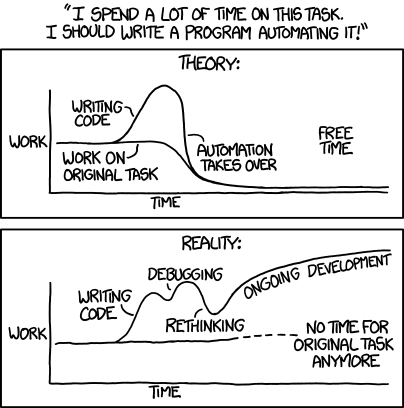

<div style="border: 2px dashed #6c757d; padding: 10px; border-radius: 10px; background-color: #f8f9fa; text-align: left; margin-bottom: 10px;">
  <p style="font-size: 18px; color: #343a40; font-family: 'Courier New', Courier, monospace;">
    <strong>@author:</strong> James V. Talwar<br>
    <strong>@adapted by:</strong> Vicente Fajardo Rosas for 2025 Class
  </p>
</div>


# <div align="center"><b>Introduction to Scripting</b></div>


Up until this point, we have been executing commands one-by-one through the command line. Wouldn't it be great if you could automate the execution of these commands? That is where scripting comes into the picture. Scripting can seem scary at first, but let's start simple:



# 1) Log in to your TSCC account

If you've forgotten how to log onto TSCC, please refer to the [TSCC tutorial](../Day_0_Setup/2_TSCC.md).

# 2) Create a `"Hello, world!"` bash script

Create a new text file with `vi`:

```bash
vi test.sh
```

Within the file, print a string that says `"Hello, world!"` using `echo`

```bash
<i>
echo "Hello, world!"
<esc>
<:wq!>
```

Now we will run the script using:

```bash
bash test.sh
```

If your script ran sucessfully, you will see `"Hello, world!"` printed in your terminal.

When we included bash before the script name in the command above, we asked to use the bash interpreter to run our script. What happens if we don't include `bash`?

```
./test.sh
```

Huh, you get the following error:

```bash
-bash: ./test.sh: Permission denied
```

In order to run a file directly, we need to change the permissions to allow the script to be executable for the user. **chmod** is a command that changes the permissions on a file and **+x** will add execute rights to the script.

```bash
chmod u+x test.sh
```

Now try to run the script. Did it work?

# 3) Running a script on a cluster

Cluster computing is a powerful way to utilize a large number of computers connected together in a shared setting. Sometimes your computational needs extend beyond your local computer and utlizing a cluster can better accomodate them. Here are some terms to be familiar with when working with clusters such as TSCC:

- **node**: nodes, or individual computers, are installed into racks and connected by network connections to each other and large storage disks.
- **head or login node**: head or login nodes are nodes that users connect to directly and then request certain resources for running programs on the cluster using special cluster management software. The purpose of the head and login nodes is to prevent users from manually running jobs in an uncoordinated and inefficient manner and to manage computing resources as efficiently as possible. Computationally intensive process should **not** be run on head nodes.
- **job**: When a request is made, the cluster management will match one of the nodes to the requested resources and runs the requested program on that node (or nodes). This request that is allocated to a node is called a *job*.
- **resources**: All jobs require a certain amount of resources. Some resources that are configured on a cluster are cores, RAM (memory), and time.

As you might remember from installing programs in bootcamp set-up, sometimes we **DO NOT** want to run any computationally intensive code on the login node.

Let's make a script with the basic structure of a cluster job script and walk through the details:

```bash
cd ~/
vi fake_script.sh
<i>
```

```bash
#!/bin/bash
#SBATCH --job-name=fake_script   # Specify a name for the job
#SBATCH --output=fake_script.out # Standard output file
#SBATCH --nodes=1                  # Request 1 node
#SBATCH --ntasks=2                 # Request 2 tasks (processes)
#SBATCH --mem=2G                   # Request 2 GB of memory
#SBATCH --time=1:00:00             # Set a time limit of 1 hour
#SBATCH --partition=hotel          # Specify the partition name
#SBATCH --qos=hotel                # Specify the quality of service
#SBATCH --account=htl191           # Specify the account

echo "Hello, world!"
```

```bash
<esc>
<:wq!>
```

We can now submit the job to the cluster using the `sbatch` command:

```bash
sbatch fake_script.sh
```

This will produce an output file called `fake_script.out` that contains the output of the script.

You can learn about which submission parameters to include and what they do [here](https://www.sdsc.edu/support/user_guides/tscc.html).

**Submitting your script**: `sbatch [script]`<br>
**Checking status of your job**: `squeue -u [username]` or `squeue -u ${USER}`<br>
**Cancelling your job**: `scancel [jobid]` <br>

# DONE!

---
