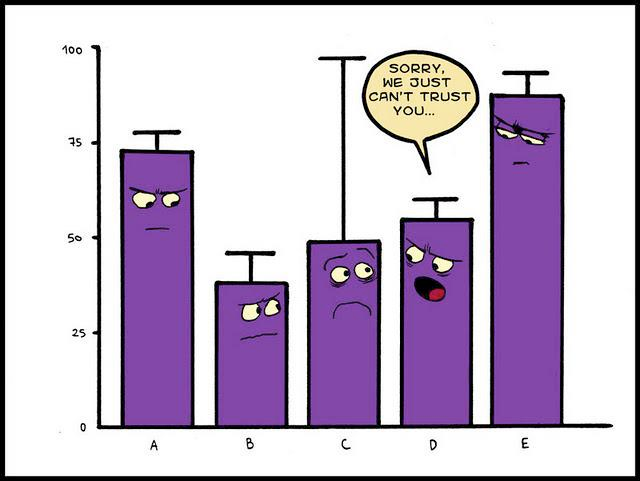
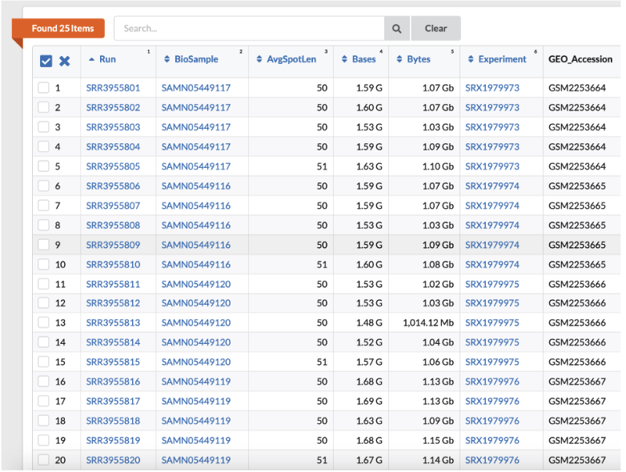

<div style="border: 2px dashed #6c757d; padding: 10px; border-radius: 10px; background-color: #f8f9fa; text-align: left; margin-bottom: 10px;">
  <p style="font-size: 18px; color: #343a40; font-family: 'Courier New', Courier, monospace;">
    <strong>@author:</strong> James V. Talwar<br>
    <strong>@adapted by:</strong> Adam Klie for 2024 Class
  </p>
</div>


# <div align="center"><b>Download dataset and data quality check</b></div>



# 1) Get dataset

First we will need to get our hands on the raw fastq files  I have already downloaded these files to `/tscc/nfs/home/hkcarter/fastq`. You can take a peak at what's there with `ls`:

```bash
ls /tscc/nfs/home/hkcarter/fastq
```

Rather than creating multiple copies of the data in each of your directories, we will make a softlink that simply points to the data:

```bash
cd ~/
ln -s /tscc/nfs/home/hkcarter/fastq ~/raw_data
```

Let's see if our softlink worked.

```bash
cd ~/raw_data/fastq
ls
```

You should see the following files.

```bash
DMSO_1_ATCACG_L001_R1.fastq
DMSO_1_ATCACG_L002_R1.fastq
DMSO_2_CGATGT_L001_R1.fastq
DMSO_2_CGATGT_L002_R1.fastq
DTP_1_CAGATC_L001_R1.fastq
DTP_1_CAGATC_L002_R1.fastq
DTP_2_CCGTCC_L001_R1.fastq
DTP_2_CCGTCC_L002_R1.fastq
DTP_3_GTGAAA_L001_R1.fastq
DTP_3_GTGAAA_L002_R1.fastq
```

There are 10 files: sequencing reads from 2 lanes from 5 experiments --> 2 DMSO controls and 3 DTP treatments.

Let's take a look at how these files are formatted. Use `head` to print the first 10 lines

```bash
head DMSO_1_ATCACG_L001_R1.fastq
```

```plaintext
@SRR3955801.1 DJB775P1:373:D1AP7ACXX:1:1101:1324:2072 length=50
NTATGATTCCTCCTAGTGCACAACCACCACGCACTCAAACACCACCTCTG
+SRR3955801.1 DJB775P1:373:D1AP7ACXX:1:1101:1324:2072 length=50
#1:AB;BDHHHGHHIIEBEGGIIIIIGGIGGHGG<GHIIGAHIIHIGGGG
@SRR3955801.2 DJB775P1:373:D1AP7ACXX:1:1101:1268:2121 length=50
TCTATCCTTTCGGAAAAAGGGACCAAATGCAACATAAAAATGTTTTCTCT
+SRR3955801.2 DJB775P1:373:D1AP7ACXX:1:1101:1268:2121 length=50
BC@FFFFFHHHHFJJJJJGHIJGHIIJIJGIIIIHIIJJGHGGHIJJJJI
@SRR3955801.3 DJB775P1:373:D1AP7ACXX:1:1101:1409:2193 length=50
CGTAAGTCTCCCTTCACCTGTTACAGAGTTTCAGATCGGTCACTGATAGT
```

FASTQ format is a common format to store sequencing data. Usually the FASTQ format uses four lines per sequence
- **Line 1** begins with a '@' character and is followed by a sequence identifier and an optional description.
- **Line 2** is the raw sequence letters.
- **Line 3** begins with a '+' character and is optionally followed by the same sequence identifier (and any description) again.
- **Line 4** encodes the quality values for the sequence in Line 2, and must contain the same number of symbols as letters in the sequence. These quality scores are usually Phred scored which are formally defined as:
$Q = -10 \log_{10}\left( Prob. Of Error\right)$. However these scores are encoded with symbols per base and are represented as: 


<div align="center">Base quality score symbol = ASCII(Q + 33)</div>

# 2) Combine fastq files

Reads from different lanes but from the same sample are typically combined. Let's write a bash script to automagically combine the fastq files from different lanes using our helpful bash command `cat`.

Let's first make a directory in our scratch folder to store the combined fastq files we will be creating.

```bash
cd ~/scratch
mkdir fastq
```

Let's move into the fastq directory and make a script to combine fastq files of different sequencing lanes

```bash
cd fastq
```

There are many different ways to do this but here is one simple way to script-ify the task:

```bash
vi combine-fastq.sh
<i>
echo "combining DMSO_1_ATCACG..."
cat ~/raw_data/fastq/DMSO_1_ATCACG* > DMSO_1_ATCACG.combined.fastq
echo "combining DMSO_2_CGATGT..."
cat ~/raw_data/fastq/DMSO_2_CGATGT* > DMSO_2_CGATGT.combined.fastq
echo "combining DTP_1_CAGATC..."
cat ~/raw_data/fastq/DTP_1_CAGATC* > DTP_1_CAGATC.combined.fastq
echo "combining DTP_2_CCGTCC..."
cat ~/raw_data/fastq/DTP_2_CCGTCC* > DTP_2_CCGTCC.combined.fastq
echo "combining DTP_3_GTGAAA..."
cat ~/raw_data/fastq/DTP_3_GTGAAA* > DTP_3_GTGAAA.combined.fastq
<esc>
<:wq!>
```

Now let's run the script we made for combining the files. We can either run with bash or by making our file executable

```bash
bash combine-fastq.sh
[or]
chmod +x combine-fastq.sh
./combine-fastq.sh
```

If the script ran successfully, we should see 5 files with suffix combined.fastq in our `/home/ucsd-train##/scratch/fastq` folder:

```bash
DMSO_1_ATCACG.combined.fastq
DMSO_2_CGATGT.combined.fastq
DTP_1_CAGATC.combined.fastq
DTP_2_CCGTCC.combined.fastq
DTP_3_GTGAAA.combined.fastq
```

# 3) Quality control of reads with `FastQC`

We will using a program called [FastQC](https://www.bioinformatics.babraham.ac.uk/projects/fastqc/) to check the quality of our sequencing data. Check that fastqc is installed:

```bash
which fastqc
```

That's not good... Wait! We are still in our `(base)` environment. Let's activate our `2025-mstp-bootcamp` environment and try again.

```bash
conda activate 2025-mstp-bootcamp
which fastqc
```

You should see something like `~/miniconda3/envs/2025-mstp-bootcamp/bin/fastqc`

Let's make a directory in our projects folder to store our fastqc results:

```bash
mkdir ~/scratch/fastqc
```

We can now run FastQC to check the quality of your sequencing results:

```
fastqc ~/scratch/fastq/*.fastq -o ~/scratch/fastqc/
```

How did I know how to run this? I used `fastqc --help` to see the options available to me.

Remember to specify the full path of where your datasets are stored and where you want the processed data to end up (`-o` flag). We can use the wildcard character `*` to specify that we want to run FastQC on any files that end in the suffix `.fastq`. Be careful with this and **REMEMBER TO USE TABS TO AVOID TYPOS!** Using wildcards can lead to unintended results if you aren't sure about all the things the wild card specifies. The argument is used to specify the location of the output files.

If FastQC is successfully running, you should see something like this:
```plaintext
Started analysis of DMSO_1_ATCACG.combined.fastq
Approx 5% complete for DMSO_1_ATCACG.combined.fastq
```

This command will take ~10m to complete, so just hang tight.

Once it's complete, we will need to copy file outputs to your desktop so you can view the output in a web browser.

Here is an example below. scp is a bash command, the syntax is always:

```bash
scp sourcefile destinationfile
```

This is the same syntax that you learned for `cp` (copy), but there is one added step for `scp` (secure copy). Since in this instance, the sourcefile is on TSCC, you need to include your login information followed by a colon before the full path of the file you would like to move. 

On your local machine (NOT TSCC) make a folder where you want this data to land and move into it. In this example, I am copying data into a folder on my desktop called mstp_bioinformatics. Keep in mind this folder must exist before you try to copy something into it. You can do this classically (e.g., right-clicking and creating a folder) or you can put your command-line expertise into use and create a folder with:

```bash
mkdir ~/Desktop/mstp_bioinformatics
``` 

Now, open another terminal window and **DO NOT** log into TSCC. This ensures that you are running this command from your local machine which you want to copy files to (and NOT TSCC). Move to the folder where you want the files you are copying to end up:

```bash
cd ~/Desktop/mstp_bioinformatics
```

Now copy your files over:

```bash
scp "<your_username>@login.tscc.sdsc.edu:~/scratch/fastqc/*.html" .
```

Here we use the wild-card character again. The destination file is simply `“.”` meaning the file that we are currently sitting in on our home computer. This is because we first moved into the directory where we want these files to be copied to.

The most common error message associated with this command will be that the file or destination does not exist. When possible, use tabs to make sure you are avoiding typos. Also copying and pasting directories directly works well. If you are getting this error, double-check what you wrote and/or that you copied the full path onto tscc.


# DONE!

---

<div style="border: 2px solid #4CAF50; padding: 15px; border-radius: 10px; background-color: #e8f5e9;">
  <h2 style="color: #388E3C; font-family: Arial, sans-serif;">
    &#128218; Pro Tip: Download data from more lanes
  </h2>
  <p style="color: #1B5E20; font-family: Arial, sans-serif;">
  You might have noticed in leacture that there are more than 2 lanes for each sample. There are actually 5 lanes for each of our 5 samples. If you are up for a challenge, you can try using data from all 5 lanes for the bootcamp. 
  </p>
</div>



**Please let me know if you plan to do this, so we can make sure we download the data to the right place.**

My recommendation for downloading the data is to use [parallel-fastq-dump](https://github.com/rvalieris/parallel-fastq-dump).

**If you end up getting stuck at any step of this, let me know. You can also check out [this GitHub repo] (https://github.com/adamklie/Hangauer2017_BT474_RNA-seq/tree/main) for some starter code.**
